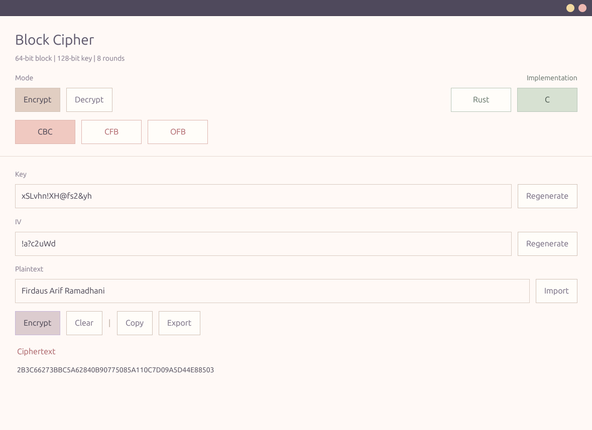
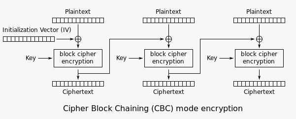
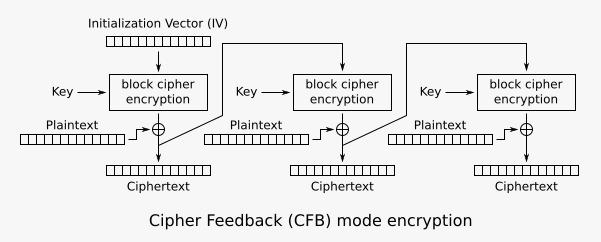
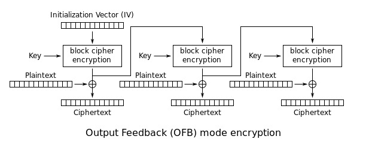

# Dokumentasi Implementasi C `main.c`

Dokumen ini menjelaskan implementasi block cipher C yang berada di `c/src/main.c`. Fokusnya adalah:

1. Tiga mode operasi `CBC`, `CFB`, dan `OFB`.

## 1. Lokasi File yang Relevan

- `c/src/main.c`: implementasi inti cipher, mode operasi, dan CLI `enc/dec`.
- `c/Makefile`: kompilasi binary C di folder `c/`.
- `Makefile`: wrapper dari root proyek untuk menghasilkan `./block_cipher`.
- `scripts/benchmark_metrics.py`: benchmark eksternal yang membandingkan CLI C dan Rust.
- `assets/CBC.png`: diagram mode CBC.
- `assets/CFB.png`: diagram mode CFB.
- `assets/OFB.png`: diagram mode OFB.
- `assets/GUI.png`: tangkapan layar GUI proyek.

## 2. Spesifikasi Implementasi

Parameter yang ditetapkan oleh macro di awal file:

| Konstanta | Nilai | Makna |
| --- | ---: | --- |
| `BLOCK_SIZE` | `8` | Ukuran blok cipher = 8 byte = 64 bit |
| `KEY_SIZE` | `16` | Ukuran kunci = 16 byte = 128 bit |
| `ROUNDS` | `8` | Jumlah ronde Feistel |

Implementasi ini memakai:

- jaringan Feistel 64-bit,
- fungsi ronde berbasis `XOR -> nibble S-Box -> rotasi/permutasi`,
- tiga mode operasi: `CBC`, `CFB`, `OFB`,
- `PKCS#7` hanya untuk `CBC`,
- payload CLI bisa diberikan langsung lewat argumen atau dibaca dari `stdin` dengan argumen `-`,
- opsi `--raw` membuat ciphertext diproses sebagai bytes mentah tanpa encoding hex.

## 3. Tampilan GUI



Fitur yang terlihat pada tampilan GUI:

- Tombol `Encrypt` dan `Decrypt` di bagian `Mode` berfungsi sebagai tab utama. `Encrypt` membuka panel input plaintext, sedangkan `Decrypt` membuka panel input ciphertext hex.
- Tombol mode `CBC`, `CFB`, dan `OFB` memilih mode operasi cipher yang dipakai oleh proses enkripsi atau dekripsi.
- Tombol `Rust` dan `C` di bagian `Implementation` memilih backend yang dipakai GUI:
  - `Rust` menjalankan fungsi cipher langsung dari library Rust proyek.
  - `C` menjalankan binary `block_cipher` eksternal. Jika binary belum tersedia, GUI menampilkan pesan agar `make` dijalankan lebih dulu.
- Kolom `Key` menerima tepat `16` karakter, dan kolom `IV` menerima tepat `8` karakter. Validasi panjang dilakukan sebelum operasi dijalankan.
- Tombol `Generate` atau `Regenerate` di samping `Key` membuat key acak kompleks sepanjang `16` karakter yang berisi kombinasi huruf besar, huruf kecil, angka, dan simbol.
- Tombol `Generate` atau `Regenerate` di samping `IV` membuat IV acak kompleks sepanjang `8` karakter.
- Area teks besar pada panel `Encrypt` adalah input `Plaintext`.
- Tombol `Import` di samping area plaintext membuka file chooser dan mengimpor isi file `.txt` atau `.md` ke area plaintext.
- Tombol aksi `Encrypt` menjalankan proses enkripsi memakai mode dan backend yang sedang dipilih.
- Tombol aksi `Decrypt` menjalankan proses dekripsi memakai mode dan backend yang sedang dipilih.
- Tombol `Clear` pada panel `Encrypt` menghapus plaintext dan hasil ciphertext.
- Tombol `Clear` pada panel `Decrypt` menghapus ciphertext input dan hasil plaintext.
- Setelah enkripsi berhasil, hasil muncul pada kartu `Ciphertext`.
- Setelah dekripsi berhasil, hasil muncul pada kartu `Plaintext`.
- Tombol `Copy` menyalin hasil ke clipboard. Setelah ditekan, label tombol berubah sementara menjadi `Done`.
- Tombol `Export` menyimpan hasil ke file `.txt` melalui file chooser:
  - hasil enkripsi disimpan dengan prefix nama file `ciphertext_...`
  - hasil dekripsi disimpan dengan prefix nama file `plaintext_...`
- Saat proses `Encrypt` berhasil, GUI juga otomatis mengisi panel dekripsi dengan ciphertext, key, dan IV yang sama agar hasil bisa langsung diuji balik.
- Dua tombol bulat di title bar kanan atas dipakai untuk kontrol jendela: tombol kuning untuk minimize, tombol merah muda untuk menutup jendela.

## 4. Alur Eksekusi Program

Secara garis besar, alurnya seperti ini:

```text
argv -> validasi command
     -> parse mode
     -> derive key dan iv dari string
     -> enc:
          plaintext arg/stdin -> encrypt_message() -> raw stdout / print_hex()
     -> dec:
          ciphertext raw/hex arg/stdin -> [hex_to_bytes bila perlu] -> decrypt_message() -> stdout
```

## 5. Penjelasan Per Bagian Kode

### 5.1 Header, macro, enum, dan struktur data

Bagian pembuka file:

```c
#include <stdint.h>
#include <stdio.h>
#include <stdlib.h>
#include <string.h>

#define BLOCK_SIZE 8
#define KEY_SIZE 16
#define ROUNDS 8
```

Peran setiap header:

- `stdint.h`: tipe eksplisit seperti `uint8_t` dan `uint32_t`.
- `stdio.h`: `printf`, `fprintf`.
- `stdlib.h`: `malloc`, `free`, `realloc`.
- `string.h`: `memcpy`, `memset`, `memcmp`, `strlen`, `strcmp`.

Enum dan struktur:

```c
typedef enum {
    MODE_CBC,
    MODE_CFB,
    MODE_OFB,
    MODE_INVALID
} CipherMode;

typedef struct {
    uint8_t *data;
    size_t len;
} Buffer;
```

`CipherMode` dipakai untuk memilih cabang mode operasi. `Buffer` adalah pasangan pointer+panjang yang dipakai hampir di seluruh alur enkripsi/dekripsi agar data biner tidak diperlakukan sebagai string C biasa.

### 5.2 S-Box dan primitive 32-bit

Tabel substitusi:

```c
static const uint8_t NIBBLE_SBOX[16] = {
    0xE, 0x4, 0xD, 0x1,
    0x2, 0xF, 0xB, 0x8,
    0x3, 0xA, 0x6, 0xC,
    0x5, 0x9, 0x0, 0x7
};
```

Cipher bekerja pada dua word 32-bit. Karena itu ada tiga helper dasar:

```c
static uint32_t rotl32(uint32_t value, unsigned shift) {
    return (value << shift) | (value >> (32U - shift));
}

static uint32_t read_u32_be(const uint8_t *src) {
    return ((uint32_t)src[0] << 24) |
           ((uint32_t)src[1] << 16) |
           ((uint32_t)src[2] << 8) |
           (uint32_t)src[3];
}

static void write_u32_be(uint8_t *dst, uint32_t value) {
    dst[0] = (uint8_t)(value >> 24);
    dst[1] = (uint8_t)(value >> 16);
    dst[2] = (uint8_t)(value >> 8);
    dst[3] = (uint8_t)value;
}
```

Maknanya:

- `rotl32`: rotasi kiri 32-bit untuk difusi bit.
- `read_u32_be`: mengubah 4 byte menjadi `uint32_t` dalam urutan big-endian.
- `write_u32_be`: kebalikannya, memecah `uint32_t` ke 4 byte.

Tahap non-linear dan difusi ada di sini:

```c
static uint32_t substitute_word(uint32_t value) {
    uint32_t out = 0;
    for (int i = 0; i < 8; ++i) {
        uint32_t nibble = (value >> (i * 4)) & 0xFU;
        out |= ((uint32_t)NIBBLE_SBOX[nibble]) << (i * 4);
    }
    return out;
}

static uint32_t permute_word(uint32_t value) {
    return rotl32(value, 3) ^ rotl32(value, 11) ^ rotl32(value, 19);
}

static uint32_t round_function(uint32_t right, uint32_t round_key) {
    uint32_t mixed = right ^ round_key;
    uint32_t substituted = substitute_word(mixed);
    return permute_word(substituted);
}
```

Urutan logikanya:

1. word kanan di-`XOR` dengan round key,
2. setiap nibble 4-bit lewat `NIBBLE_SBOX`,
3. hasilnya dipermutasi lewat kombinasi tiga rotasi dan `XOR`.

### 5.3 Ekspansi kunci

Fungsi pembangkit round key:

```c
static void generate_round_keys(const uint8_t key[KEY_SIZE], uint32_t round_keys[ROUNDS]) {
    uint32_t a = read_u32_be(key);
    uint32_t b = read_u32_be(key + 4);
    uint32_t c = read_u32_be(key + 8);
    uint32_t d = read_u32_be(key + 12);

    for (int i = 0; i < ROUNDS; ++i) {
        uint32_t mix = rotl32(a ^ c, (unsigned)((i % 7) + 1)) +
                       rotl32(b ^ d, (unsigned)(((i + 2) % 7) + 1)) +
                       (0x9E3779B9u * (uint32_t)(i + 1));
        round_keys[i] = substitute_word(mix ^ rotl32(d, (unsigned)(((i + 4) % 9) + 1)));

        {
            uint32_t next = a ^ rotl32(round_keys[i], 7) ^ (0xA5A5A5A5u + (uint32_t)i * 0x01010101u);
            a = b;
            b = c;
            c = d;
            d = next;
        }
    }
}
```

Hal penting pada key schedule:

- 16 byte kunci dibagi jadi empat word: `a`, `b`, `c`, `d`.
- Tiap ronde membuat `mix` dari kombinasi `XOR`, rotasi, dan konstanta.
- `substitute_word()` dipakai lagi agar round key tidak linear.
- Setelah satu round key keluar, state internal key schedule digeser seperti register.

Keluaran fungsi ini adalah `round_keys[8]`, satu kunci 32-bit per ronde.

### 5.4 Enkripsi satu blok

Blok 64-bit dipisah menjadi `left` dan `right`, lalu diproses sebagai Feistel:

```c
static void encrypt_block(const uint8_t in[BLOCK_SIZE], uint8_t out[BLOCK_SIZE], const uint32_t round_keys[ROUNDS]) {
    uint32_t left = read_u32_be(in);
    uint32_t right = read_u32_be(in + 4);

    for (int i = 0; i < ROUNDS; ++i) {
        uint32_t next_left = right;
        uint32_t next_right = left ^ round_function(right, round_keys[i]);
        left = next_left;
        right = next_right;
    }

    write_u32_be(out, right);
    write_u32_be(out + 4, left);
}
```

Persamaan Feistel-nya:

```text
L(i+1) = R(i)
R(i+1) = L(i) XOR F(R(i), K(i))
output  = R(8) || L(8)
```

Catatan penting: output ditulis sebagai `right` lalu `left`, jadi ada swap final.

### 5.5 Dekripsi satu blok

Karena Feistel bersifat simetris, dekripsi tidak butuh inverse S-Box terpisah. Cukup balik urutan round key:

```c
static void decrypt_block(const uint8_t in[BLOCK_SIZE], uint8_t out[BLOCK_SIZE], const uint32_t round_keys[ROUNDS]) {
    uint32_t right = read_u32_be(in);
    uint32_t left = read_u32_be(in + 4);

    for (int i = ROUNDS - 1; i >= 0; --i) {
        uint32_t prev_right = left;
        uint32_t prev_left = right ^ round_function(left, round_keys[i]);
        right = prev_right;
        left = prev_left;
    }

    write_u32_be(out, left);
    write_u32_be(out + 4, right);
}
```

Jadi, enkripsi dan dekripsi blok sama-sama bertumpu pada `round_function()`. Yang berubah hanya arah traversal `round_keys`.

### 5.6 Helper data, konversi, dan padding

#### `xor_block`

```c
static void xor_block(uint8_t *dst, const uint8_t *src) {
    for (size_t i = 0; i < BLOCK_SIZE; ++i) {
        dst[i] ^= src[i];
    }
}
```

Dipakai oleh CBC saat plaintext atau hasil dekripsi perlu di-`XOR` dengan feedback.

#### `derive_bytes`

```c
static void derive_bytes(const char *text, uint8_t *dst, size_t size) {
    size_t len = strlen(text);
    memset(dst, 0, size);
    if (len > size) {
        len = size;
    }
    memcpy(dst, text, len);
}
```

Ini bukan KDF kriptografis. Fungsi ini hanya:

- memotong string jika terlalu panjang,
- mengisi nol jika terlalu pendek.

Akibatnya:

- key diambil dari 16 karakter pertama,
- IV diambil dari 8 karakter pertama.

#### `hex_value` dan `hex_to_bytes`

```c
static int hex_value(char c) {
    if (c >= '0' && c <= '9') {
        return c - '0';
    }
    if (c >= 'a' && c <= 'f') {
        return 10 + (c - 'a');
    }
    if (c >= 'A' && c <= 'F') {
        return 10 + (c - 'A');
    }
    return -1;
}
```

```c
static Buffer hex_to_bytes(const char *hex) {
    Buffer out = {NULL, 0};
    size_t len = strlen(hex);

    if ((len % 2) != 0) {
        return out;
    }

    out.data = (uint8_t *)malloc(len / 2 == 0 ? 1 : len / 2);
    if (out.data == NULL) {
        return out;
    }

    for (size_t i = 0; i < len; i += 2) {
        int high = hex_value(hex[i]);
        int low = hex_value(hex[i + 1]);
        if (high < 0 || low < 0) {
            free(out.data);
            out.data = NULL;
            return out;
        }
        out.data[i / 2] = (uint8_t)((high << 4) | low);
    }

    out.len = len / 2;
    return out;
}
```

Fungsi ini dipakai saat mode `dec`, karena input ciphertext dari CLI diberikan sebagai string heksadesimal.

#### `clone_buffer`

Dipakai untuk menyalin input mentah ke buffer baru, terutama pada `CFB` dan `OFB` yang tidak memakai padding.

#### `pkcs7_pad` dan `pkcs7_unpad`

```c
static Buffer pkcs7_pad(const uint8_t *src, size_t len) {
    Buffer out = {NULL, 0};
    size_t padding = BLOCK_SIZE - (len % BLOCK_SIZE);
    if (padding == 0) {
        padding = BLOCK_SIZE;
    }
    ...
}
```

```c
static Buffer pkcs7_unpad(const uint8_t *src, size_t len) {
    Buffer out = {NULL, 0};
    if (len == 0 || (len % BLOCK_SIZE) != 0) {
        return out;
    }
    ...
}
```

Perilakunya:

- selalu menambahkan minimal 1 byte padding,
- jika plaintext sudah kelipatan 8 byte, satu blok padding penuh tetap ditambahkan,
- saat dekripsi, padding diverifikasi byte-per-byte,
- jika padding tidak valid, fungsi mengembalikan buffer kosong (`data == NULL`).

#### `print_hex`

Mengubah ciphertext biner menjadi string hex huruf besar, dua digit per byte.

### 5.7 Parsing mode

Mode didukung oleh dua helper:

```c
static CipherMode parse_mode(const char *text) { ... }
```

Fungsinya:

- `parse_mode`: mengubah `cbc`, `cfb`, `ofb` menjadi enum.

`mode_uses_padding()` juga penting karena memisahkan perilaku `CBC` dari `CFB/OFB`.

```c
static int mode_uses_padding(CipherMode mode) {
    return mode == MODE_CBC;
}
```

### 5.8 Utilitas memori, stdin, dan usage

#### `free_buffer`

```c
static void free_buffer(Buffer *buffer) {
    if (buffer->data != NULL) {
        free(buffer->data);
        buffer->data = NULL;
    }
    buffer->len = 0;
}
```

Fungsi ini membebaskan memori lalu mereset `pointer` dan `len`. Pola ini dipakai berkali-kali supaya buffer bekas pakai tidak dibiarkan menggantung.

#### `read_stdin_all` dan `trim_trailing_line_endings`

Kedua helper ini mendukung mode payload `-` pada CLI:

- `read_stdin_all` membaca seluruh isi `stdin` ke dalam `Buffer`, baik untuk plaintext enkripsi maupun ciphertext saat dekripsi.
- `trim_trailing_line_endings` menghapus `\n` atau `\r\n` di ujung input `stdin` agar ciphertext hex dari pipe tetap valid saat mode default dipakai.

#### `print_usage`

```c
static void print_usage(const char *program) {
    printf("Usage:\n");
    printf("  %s enc <mode> <key16> <iv8> <plaintext|-> [--raw]\n", program);
    printf("  %s dec <mode> <key16> <iv8> <ciphertext_hex|-> [--raw]\n\n", program);
    printf("Modes: cbc, cfb, ofb\n");
    printf("Catatan:\n");
    printf("- Key diambil dari 16 karakter pertama.\n");
    printf("- IV diambil dari 8 karakter pertama.\n");
    printf("- CBC memakai padding PKCS#7.\n");
    printf("- Gunakan '-' sebagai payload untuk membaca data dari stdin.\n");
    printf("- Tambahkan '--raw' agar ciphertext diproses sebagai bytes mentah.\n");
}
```

Fungsi ini merangkum kontrak CLI. Dokumen ini pada dasarnya mengurai isi `print_usage()` menjadi penjelasan teknis yang lebih rinci.

## 6. Tiga Mode Operasi

Bagian ini adalah inti dari implementasi level pesan. Semua mode dimulai dengan `feedback = iv`, tetapi cara feedback diperbarui berbeda untuk tiap mode. Itulah yang menentukan antara enkripsi dan dekripsi.

### 6.1 CBC: sinkron lewat ciphertext blok sebelumnya



Rumus:

```text
F(0) = IV
Encrypt:
  C(i) = E(P(i) XOR F(i))
  F(i+1) = C(i)

Decrypt:
  P(i) = D(C(i)) XOR F(i)
  F(i+1) = C(i)
```

Potongan kode enkripsi:

```c
if (mode == MODE_CBC) {
    for (size_t offset = 0; offset < input.len; offset += BLOCK_SIZE) {
        uint8_t block[BLOCK_SIZE];
        memcpy(block, input.data + offset, BLOCK_SIZE);
        xor_block(block, feedback);
        encrypt_block(block, output.data + offset, round_keys);
        memcpy(feedback, output.data + offset, BLOCK_SIZE);
    }
}
```

Potongan kode dekripsi:

```c
if (mode == MODE_CBC) {
    for (size_t offset = 0; offset < len; offset += BLOCK_SIZE) {
        uint8_t block[BLOCK_SIZE];
        decrypt_block(ciphertext + offset, block, round_keys);
        xor_block(block, feedback);
        memcpy(temp.data + offset, block, BLOCK_SIZE);
        memcpy(feedback, ciphertext + offset, BLOCK_SIZE);
    }
}
```

Maknanya:

- Pengirim dan penerima harus memulai dari IV yang sama.
- Setelah blok ke-`i` selesai, kedua sisi sama-sama sepakat bahwa feedback berikutnya adalah `C(i)`.
- Jika satu byte ciphertext hilang di tengah, setelahnya ikut rusak karena blok berikutnya memakai feedback yang salah.
- `CBC` memakai `PKCS#7`, jadi panjang ciphertext selalu kelipatan 8 byte.

### 6.2 CFB: sinkron lewat register feedback yang diisi ciphertext



Rumus:

```text
F(0) = IV
S(i) = E(F(i))
Encrypt:
  C(i) = P(i) XOR S(i)
  F(i+1) = C(i)

Decrypt:
  P(i) = C(i) XOR S(i)
  F(i+1) = C(i)
```

Potongan kode enkripsi:

```c
} else if (mode == MODE_CFB) {
    for (size_t offset = 0; offset < input.len; offset += BLOCK_SIZE) {
        size_t chunk = input.len - offset;
        if (chunk > BLOCK_SIZE) {
            chunk = BLOCK_SIZE;
        }
        encrypt_block(feedback, stream, round_keys);
        for (size_t i = 0; i < chunk; ++i) {
            output.data[offset + i] = input.data[offset + i] ^ stream[i];
        }
        memcpy(feedback, output.data + offset, chunk);
        if (chunk < BLOCK_SIZE) {
            memcpy(feedback + chunk, stream + chunk, BLOCK_SIZE - chunk);
        }
    }
}
```

Potongan kode dekripsi:

```c
} else if (mode == MODE_CFB) {
    for (size_t offset = 0; offset < len; offset += BLOCK_SIZE) {
        size_t chunk = len - offset;
        if (chunk > BLOCK_SIZE) {
            chunk = BLOCK_SIZE;
        }
        encrypt_block(feedback, stream, round_keys);
        for (size_t i = 0; i < chunk; ++i) {
            temp.data[offset + i] = ciphertext[offset + i] ^ stream[i];
        }
        memcpy(feedback, ciphertext + offset, chunk);
        if (chunk < BLOCK_SIZE) {
            memcpy(feedback + chunk, stream + chunk, BLOCK_SIZE - chunk);
        }
    }
}
```

Maknanya:

- `encrypt_block()` dipakai pada enkripsi dan dekripsi, karena CFB memakai block cipher untuk membangkitkan stream.
- Feedback berikutnya diisi oleh ciphertext, bukan plaintext.
- Implementasi ini mendukung blok terakhir parsial. Jika `chunk < BLOCK_SIZE`, sisa register feedback diisi dari sisa `stream`.
- Pengisian sisa register itu penting agar enkripsi dan dekripsi memakai register 8-byte yang identik pada langkah terakhir.

### 6.3 OFB: sinkron lewat keystream internal, bukan ciphertext



Rumus:

```text
F(0) = IV
F(i+1) = E(F(i))
Output(i) = Input(i) XOR F(i+1)
```

Karena bentuknya stream, enkripsi dan dekripsi identik:

```c
} else if (mode == MODE_OFB) {
    for (size_t offset = 0; offset < input.len; offset += BLOCK_SIZE) {
        size_t chunk = input.len - offset;
        if (chunk > BLOCK_SIZE) {
            chunk = BLOCK_SIZE;
        }
        encrypt_block(feedback, feedback, round_keys);
        for (size_t i = 0; i < chunk; ++i) {
            output.data[offset + i] = input.data[offset + i] ^ feedback[i];
        }
    }
}
```

Dan pada dekripsi:

```c
} else if (mode == MODE_OFB) {
    for (size_t offset = 0; offset < len; offset += BLOCK_SIZE) {
        size_t chunk = len - offset;
        if (chunk > BLOCK_SIZE) {
            chunk = BLOCK_SIZE;
        }
        encrypt_block(feedback, feedback, round_keys);
        for (size_t i = 0; i < chunk; ++i) {
            temp.data[offset + i] = ciphertext[offset + i] ^ feedback[i];
        }
    }
}
```

Maknanya:

- Feedback berikutnya diturunkan dari feedback sebelumnya, bukan dari ciphertext.
- Jika ciphertext berubah, keystream internal tetap sama selama IV dan key sama.
- Karena itu enkripsi dan dekripsi OFB benar-benar simetris.
- OFB tidak butuh padding; blok terakhir boleh parsial.

## 7. Implementasi `encrypt_message()` dan `decrypt_message()`

Fungsi level pesan:

```c
static Buffer encrypt_message(CipherMode mode, const uint8_t *plaintext, size_t len,
                              const uint8_t key[KEY_SIZE], const uint8_t iv[BLOCK_SIZE]) { ... }

static Buffer decrypt_message(CipherMode mode, const uint8_t *ciphertext, size_t len,
                              const uint8_t key[KEY_SIZE], const uint8_t iv[BLOCK_SIZE]) { ... }
```

Tugas `encrypt_message()`:

1. bangkitkan `round_keys`,
2. siapkan `input`:
   - `CBC` -> `pkcs7_pad`,
   - `CFB/OFB` -> `clone_buffer`,
3. alokasikan `output`,
4. salin `iv` ke `feedback`,
5. jalankan loop sesuai mode,
6. bebaskan buffer sementara.

Tugas `decrypt_message()`:

1. bangkitkan `round_keys`,
2. validasi panjang ciphertext untuk `CBC`,
3. alokasikan `temp`,
4. salin `iv` ke `feedback`,
5. jalankan loop sesuai mode,
6. bila `CBC`, hilangkan padding lewat `pkcs7_unpad`,
7. untuk `CFB/OFB`, langsung kembalikan `temp`.

Hal penting:

- `CBC` dekripsi gagal jika panjang ciphertext bukan kelipatan 8 byte.
- `CFB` dan `OFB` bisa memproses panjang berapa pun.
- Payload `enc` dan `dec` bisa dibaca dari argumen `argv[5]` atau dari `stdin` jika `argv[5] == "-"`.
- Opsi `--raw` menghindari encode/decode hex, sehingga cocok untuk alur biner seperti benchmark Python.

## 8. Dispatch CLI pada `main()`

Fungsi `main()` sekarang membagi operasi menjadi dua command:

- `enc <mode> <key16> <iv8> <plaintext|-> [--raw]`
- `dec <mode> <key16> <iv8> <ciphertext_hex|-> [--raw]`

Lalu parsing mode dan derivasi key/IV:

```c
CipherMode mode = parse_mode(argv[2]);
if (mode == MODE_INVALID) {
    fprintf(stderr, "Mode tidak dikenal: %s\n", argv[2]);
    print_usage(argv[0]);
    return 1;
}

derive_bytes(argv[3], key, KEY_SIZE);
if (strcmp(argv[4], "-") == 0) {
    fprintf(stderr, "Mode %s memerlukan IV 8 karakter.\n", argv[2]);
    return 1;
}
derive_bytes(argv[4], iv, BLOCK_SIZE);
```

Cabang enkripsi memilih sumber plaintext:

- jika `argv[5]` adalah teks biasa, plaintext dibaca langsung dari argumen,
- jika `argv[5] == "-"`, plaintext dibaca penuh dari `stdin` lewat `read_stdin_all`.

Setelah itu, buffer tersebut dikirim ke `encrypt_message()`. Jika `--raw` tidak dipakai, hasil dicetak oleh `print_hex()`. Jika `--raw` dipakai, ciphertext ditulis langsung ke `stdout` sebagai bytes mentah tanpa newline tambahan.

Cabang dekripsi memilih sumber ciphertext dengan aturan yang sama:

- pada mode default, ciphertext diperlakukan sebagai string hex,
- `-` membuat program membaca seluruh `stdin`,
- jika input hex datang dari `stdin`, newline di ujung akan dibuang oleh `trim_trailing_line_endings`,
- pada mode default, string hex diubah ke bytes oleh `hex_to_bytes()` sebelum dikirim ke `decrypt_message()`,
- jika `--raw` dipakai, ciphertext dibaca apa adanya sebagai bytes mentah tanpa parsing hex.

Detail perilaku CLI:

- plaintext enkripsi bisa datang dari argumen atau `stdin`,
- ciphertext dekripsi default-nya berupa hex valid, baik dari argumen maupun `stdin`,
- `--raw` membuat output enkripsi dan input dekripsi memakai ciphertext biner mentah,
- output enkripsi default tetap hex uppercase,
- output dekripsi tetap ditulis ke `stdout` secara `binary-safe`; newline hanya ditambahkan pada mode default.

## 9. Daftar Seluruh Fungsi dan Tugasnya

| Fungsi | Tugas |
| --- | --- |
| `rotl32` | rotasi kiri word 32-bit |
| `read_u32_be` | baca 4 byte menjadi `uint32_t` big-endian |
| `write_u32_be` | tulis `uint32_t` ke 4 byte big-endian |
| `substitute_word` | substitusi 8 nibble memakai `NIBBLE_SBOX` |
| `permute_word` | difusi bit lewat kombinasi rotasi |
| `round_function` | fungsi ronde `F(right, round_key)` |
| `generate_round_keys` | menghasilkan 8 round key dari key 128-bit |
| `encrypt_block` | enkripsi 1 blok 64-bit |
| `decrypt_block` | dekripsi 1 blok 64-bit |
| `xor_block` | `XOR` dua blok 8 byte |
| `derive_bytes` | potong/zero-pad string menjadi key atau IV |
| `hex_value` | ubah 1 karakter hex menjadi nilai nibble |
| `clone_buffer` | alokasi dan salin buffer |
| `pkcs7_pad` | tambah padding PKCS#7 |
| `pkcs7_unpad` | validasi dan hapus padding PKCS#7 |
| `hex_to_bytes` | ubah string hex menjadi buffer biner |
| `print_hex` | cetak buffer sebagai hex uppercase |
| `parse_mode` | ubah string mode ke enum |
| `mode_uses_padding` | penentu bahwa hanya CBC memakai padding |
| `encrypt_message` | enkripsi data arbitrer di level pesan |
| `decrypt_message` | dekripsi data arbitrer di level pesan |
| `free_buffer` | bebaskan buffer dan reset field |
| `read_stdin_all` | baca seluruh `stdin` ke `Buffer` |
| `trim_trailing_line_endings` | hapus newline ujung pada input `stdin` |
| `print_usage` | cetak panduan penggunaan CLI |
| `main` | entry point dan dispatcher command |

## 10. Contoh Penggunaan yang Sudah Diverifikasi

Binary C bisa dibangun dari root:

```bash
make
```

Atau langsung dari folder `c`:

```bash
make -C c
```

### Enkripsi CBC

```bash
./block_cipher enc cbc "KAMSIS-KEY-2026!" "IV2026!!" "Firdaus Arif Ramadhani"
```

Output:

```text
038C3CEEA812E09D1DEE329B18C4CAB8A27FF467E01015AE
```

### Dekripsi CBC

```bash
./block_cipher dec cbc "KAMSIS-KEY-2026!" "IV2026!!" "038C3CEEA812E09D1DEE329B18C4CAB8A27FF467E01015AE"
```

Output:

```text
Firdaus Arif Ramadhani
```

### Enkripsi CFB

```bash
./block_cipher enc cfb "KAMSIS-KEY-2026!" "IV2026!!" "Firdaus Arif Ramadhani"
```

Output:

```text
F6A43066D4A8FE5100620D529E7969BCF96CEF932C25
```

### Enkripsi OFB

```bash
./block_cipher enc ofb "KAMSIS-KEY-2026!" "IV2026!!" "Firdaus Arif Ramadhani"
```

Output:

```text
F6A43066D4A8FE51E2EE1C8DDE8D620D32BF8EA2D1DB
```

### Enkripsi lewat `stdin`

```bash
printf 'Firdaus Arif Ramadhani' | ./block_cipher enc cbc "KAMSIS-KEY-2026!" "IV2026!!" -
```

Output:

```text
038C3CEEA812E09D1DEE329B18C4CAB8A27FF467E01015AE
```

### Dekripsi lewat `stdin`

```bash
printf '038C3CEEA812E09D1DEE329B18C4CAB8A27FF467E01015AE' | ./block_cipher dec cbc "KAMSIS-KEY-2026!" "IV2026!!" -
```

Output:

```text
Firdaus Arif Ramadhani
```
