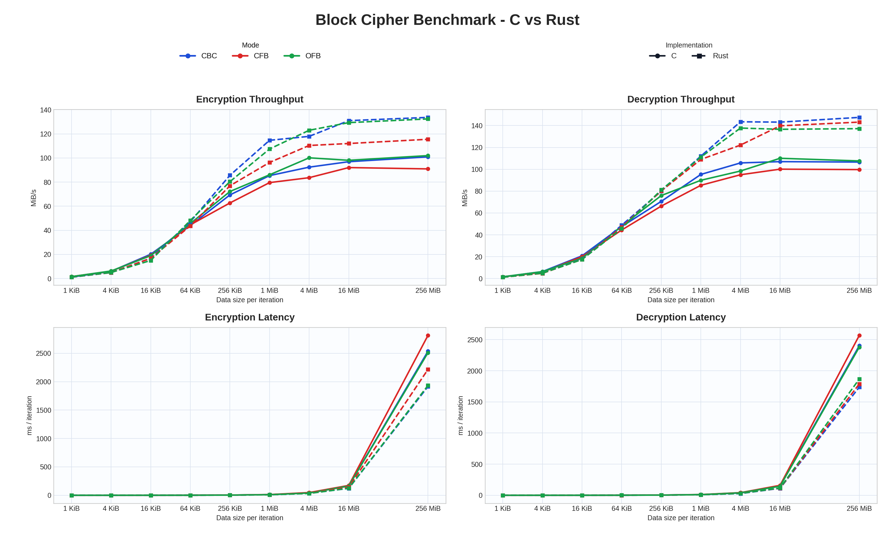

# Cipherz

Toolkit cipher blok kustom dengan dua implementasi: `C` sebagai dasar tingkat rendah yang bersih, dan `Rust` untuk CLI utama serta GUI desktop. Keduanya menjalankan desain cipher yang sama, sedangkan benchmark dijalankan terpisah lewat skrip Python.

## Gambaran Umum

- ukuran blok `64-bit`
- ukuran kunci `128-bit`
- jaringan Feistel `8-round`
- fungsi ronde dengan `XOR`, nibble `S-Box`, rotasi, dan permutasi bit
- mode: `CBC`, `CFB`, `OFB`

## Komponen yang Tersedia

- CLI dalam `C`
- CLI dan GUI dalam `Rust`
- impor GUI untuk `.txt` dan `.md`
- ekspor GUI ke `.txt`
- alur benchmark dengan `CSV` dan dashboard `PNG`
- pengujian Rust yang menjaga kesetaraan output terhadap implementasi C

## Alasan Dua Implementasi

- `C` membuat cipher tetap mudah diperiksa pada level terendah.
- `Rust` adalah lapisan aplikasi utama: model memori lebih aman, ergonomi lebih rapi, dan mendukung GUI.

## Instalasi

Instalasi standar:

Linux atau macOS:

```bash
curl -fsSL https://raw.githubusercontent.com/fxrdhan/Cipherz/main/install.sh | sh
```

PowerShell Windows:

```powershell
Invoke-WebRequest https://raw.githubusercontent.com/fxrdhan/Cipherz/main/install.ps1 -OutFile install.ps1
./install.ps1
```

Instalasi default tidak otomatis menjalankan aplikasi. Gunakan `--run-ui` atau `-RunUI` jika Anda ingin installer langsung membuka GUI setelah proses setup selesai.

## Kompilasi dan Eksekusi dari Kode Sumber

Clone repositori terlebih dahulu:

```bash
git clone https://github.com/fxrdhan/Cipherz.git
cd Cipherz
```

### Membangun Binary C

```bash
make
```

### Menjalankan Implementasi C

```bash
./block_cipher enc cbc "KAMSIS-KEY-2026!" "IV2026!!" "Firdaus Arif Ramadhani"
./block_cipher dec cbc "KAMSIS-KEY-2026!" "IV2026!!" "<ciphertext_hex>"
```

### Membangun Implementasi Rust

```bash
cargo build
```

### Menjalankan CLI Rust

```bash
cargo run --bin cipherz_cli -- enc cbc "KAMSIS-KEY-2026!" "IV2026!!" "Firdaus Arif Ramadhani"
cargo run --bin cipherz_cli -- dec cbc "KAMSIS-KEY-2026!" "IV2026!!" "<ciphertext_hex>"
```

### Menjalankan GUI Rust

```bash
cargo run --bin cipherz_gui
```

## Mode Operasi yang Didukung

Mode yang tersedia:

- `cbc`
- `cfb`
- `ofb`

## Benchmark dan Kinerja

Hasilkan benchmark dan dashboard perbandingan lengkap lewat skrip Python:

```bash
python3 scripts/benchmark_metrics.py
```

CLI `C` dan `Rust` tidak lagi menyediakan subcommand benchmark internal. Skrip ini akan membangun binary yang dibutuhkan, menjalankan `enc` dan `dec` untuk kedua implementasi, lalu menghasilkan artifact `CSV` dan dashboard `PNG` di `artifacts/benchmark/`.


